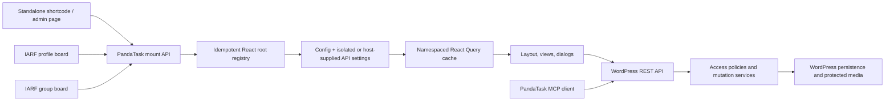

# PandaTask frontend and ecosystem audit

Date: 2026-07-30  
Target release: 1.0.15  
Baseline reviewed: `a26a7fe` (`main`)  
Security scan: `8dad8ede-6c6f-4546-a0e8-ad52a3f85dbc`

## Executive outcome

PandaTask remains a React 18 WordPress plugin that can mount from its own shortcode/admin surfaces or through the public `window.Pandatask` integration API used by IARF Platform and IARF Network. The review found no critical or high-severity application-security findings, but it did find six medium and nine low findings, several routing and cache-consistency weaknesses, host-layout assumptions that specifically harmed group boards, avoidable React lifecycle risks, an incomplete TypeScript boundary, and release tooling that did not provide a safe atomic dev deployment.

The 1.0.15 work addresses the release-blocking and high-value findings:

- group/profile/standalone layouts now respond to the board's actual container rather than the browser width;
- tabs, views, and task dialogs are URL-addressable and support back/forward navigation;
- query keys, retry policy, cancellation, error objects, and cache invalidation are centralized;
- expensive Gantt and modal code is split into retryable lazy chunks;
- root mounting is idempotent and host integrations can coexist in the shared namespace;
- the reviewed medium security findings are fixed, and the two media-storage findings are materially mitigated;
- frontend infrastructure has strict TypeScript coverage and a staged migration boundary;
- CI now checks types, PHP compatibility, policies, lint, tests, production dependencies, and bundle budgets;
- the dev release path builds a clean runtime package, validates it in staging, swaps atomically, and rolls back on a failed post-swap check.

There are deliberate residuals. The task endpoint is now bounded to 500 rows, but a proper paginated/infinite-query user experience is still required for boards above that size. Public WordPress Media Library originals remain public even though PandaTask's task copy is protected; the UI and API now disclose that fact, but a future private-ingest path is the complete solution. Aggregate attachment quotas and content-addressed deduplication also remain follow-up architecture work.

## Scope and evidence

The audit covered:

- all frontend source, styles, entry points, React Query hooks, and build output;
- REST request/response handling that directly affects frontend behavior;
- authorization, attachment delivery, public bug submission, recurrence generation, user lookup, and AI prompt construction;
- the MCP companion because it is another supported PandaTask client;
- the IARF Network integration points and live profile/group containers, without modifying the dirty IARF Network worktree;
- package manifests, lockfiles, production and full development dependency audits;
- GitHub Actions, packaging, version metadata, and dev deployment/rollback behavior;
- live WordPress 7.0.2 behavior on the IARF dev environment.

Methods included manual data-flow and lifecycle review, source comparison across the IARF ecosystem, PHP_CodeSniffer, PHPStan, Composer audit, TypeScript strict checking, WordPress ESLint/Stylelint, Node tests, PHP policy tests, build-size analysis, npm production audits, an exhaustive 198-file Codex Security scan, and React Doctor advisory analysis.

## Supported architecture

The integration contract is intentionally small:

- `window.Pandatask.mountBoard(container, props)` mounts a board;
- `window.Pandatask.mountFloatingBugReporter(container, props)` mounts the reporter;
- the host may supply `apiSettings.apiClient`, otherwise PandaTask creates a nonce-authenticated client from `root` and `nonce`;
- every mount owns a stable React root and a namespaced query cache;
- cleanup functions are token-protected so an old host cleanup cannot unmount a newer render;
- the namespace is merged rather than overwritten.

## Findings and implemented changes

### 1. Host integration and group-board styling

**Finding.** The frontend selected desktop/mobile structure from `window.innerWidth` and assumed room for a fixed 240px project sidebar. IARF group content is placed in a narrower content slot than the profile board even at the same viewport width. The viewport therefore selected a desktop layout that did not fit the group container. Host-theme layout rules could also leak through duplicated container classes.

**Implementation.**

- Added a callback-ref/`ResizeObserver` container measurement hook with a resize fallback and explicit cleanup.
- Introduced a 1080px container breakpoint and container mode attributes/classes.
- Narrow containers use an overlay/collapsible sidebar and close it automatically when the host slot contracts.
- Separated the React mount boundary from `.pandat69-container` and applied stable IARF product/plugin markers.
- Kept profile, group, shortcode, admin, and fullscreen rendering on the same component path to prevent style drift.

**Result.** The layout decision now follows available board width, which fixes the root cause of the group/profile disparity rather than adding a group-only CSS exception.

### 2. Routing and browser history

**Finding.** UI state lived only in React state. The legacy `open_task` parameter was consumed destructively, and tabs/views/dialogs did not round-trip through browser history. Deep links and Back could therefore produce stale or surprising UI.

**Implementation.**

- Added a navigation hook backed by `URLSearchParams` and `popstate`.
- Added validated `pandatask_tab`, `pandatask_view`, and `open_task` state.
- Tab/view changes push history entries; default states remove unnecessary parameters.
- Task dialogs push a marked history entry, close through Back when appropriate, and use replace semantics for legacy or programmatic navigation.
- Invalid tab/view/task values are ignored rather than becoming component state.

**Result.** Standalone and embedded boards now have bookmarkable state and predictable back/forward behavior without introducing a full router dependency into a WordPress mount.

### 3. Data fetching, cache behavior, and API errors

**Findings.**

- Query keys were ad hoc and invalidations were broader or inconsistent than intended.
- Axios errors were reduced to strings, losing WordPress status, error code, and details.
- Queries did not consistently pass the React Query cancellation signal.
- Retry behavior could repeat authorization or validation failures.
- The task collection could be requested without a limit.

**Implementation.**

- Added a single typed `queryKeys` factory under a `pandatask` root.
- Added a central query-client factory with 30-second freshness, ten-minute garbage collection, reconnect refresh, no focus refresh, and a maximum of two attempts.
- Disabled retries for cancellations and HTTP 400/401/403/404/409/422 responses.
- Added `PandataskApiError` with status, WordPress code, details, cancellation state, and original cause.
- Added a 30-second HTTP timeout and propagated `AbortSignal` from every query.
- Normalized mutation invalidation to the smallest safe board/detail/history scopes.
- Set both the frontend request and server default task limit to 500.

**Residual.** The response already exposes pagination metadata, but the UI still needs a paginated or infinite-query presentation before boards can intentionally exceed 500 visible tasks.

### 4. React lifecycle and component structure

**Findings.**

- Multiple mounts could create duplicate roots and handlers.
- Host cleanup could race a later remount.
- the WordPress media frame and several document/window listeners were difficult to prove leak-free;
- `CompactListView` mutated a ref during render;
- `FilterBar` declared a component inside its render and attached document listeners too broadly;
- `Layout` mixed navigation, responsive structure, data orchestration, five views, and five modal families;
- several views/forms remain large enough to slow review and increase change risk.

**Implementation.**

- Added a `WeakMap` root registry, idempotent render, token-safe cleanup, and immediate/DOMContentLoaded bootstrap paths.
- Added top-level and board-level error boundaries with a recoverable failure presentation.
- Made media-frame creation lazy, reused a single frame, and colocated subscription cleanup.
- Colocated container observation and resize cleanup in a single effect.
- Moved the filter dropdown to module scope and only listens while open.
- Replaced render-time ref mutation with memoized parent-ID derivation.
- Split `TaskWorkspace` and `BoardModals` out of `Layout`.
- Lazy-loaded Gantt, report, task detail, task form, and project form with one retry for transient stale-chunk failures.
- Added stable avatar dimensions, native lazy loading, and asynchronous decoding.

**Residual decomposition backlog.**

| Component | Approximate lines | Recommended seam |
|---|---:|---|
| `GanttView.jsx` | 819 | viewport/header, dependency overlay, row renderer, interaction controller |
| `ganttModel.mjs` | 496 | date window, hierarchy, dependency graph, geometry |
| `TaskForm.jsx` | 491 | identity/schedule/roles/recurrence/attachment fieldsets |
| `TaskDetail.jsx` | 414 | summary, roles, comments, history, attachment |
| `Layout.jsx` | 364 after extraction | reducer/controller hook, fullscreen shell, project navigation |

Decomposition should follow behavior tests, not line count alone. Gantt in particular now has safety tests and should be split only with those invariants preserved.

### 5. TypeScript

**Finding.** The application had JavaScript-only frontend infrastructure despite an existing TypeScript MCP client. API response assumptions and cache-key shapes were therefore unchecked.

**Implementation.**

- Migrated the API client to strict TypeScript.
- Added frontend domain/filter/response types.
- Added typed query-key and query-client modules.
- Added an isolated strict `tsconfig.frontend.json` with `noUncheckedIndexedAccess`, `exactOptionalPropertyTypes`, unused checks, and no emit.
- Added TypeScript and React 18 type packages and made `typecheck` a CI/release check.

**Decision.** This is staged migration, not a claim that all JSX is typed. New boundary/infrastructure modules should be TypeScript; behavior-heavy legacy components should migrate when decomposed so that large mechanical conversions do not obscure functional review.

### 6. Rendering and bundle performance

**Findings and changes.**

- Gantt could derive an effectively unbounded day grid from hostile or corrupt dates. Dates are now validated to 1900–2200, the rendered timeline is capped at 1,096 days, off-window bars/edges are clipped, and truncation is explained.
- Modal and specialist views were in the initial dependency graph. Large low-frequency views are now lazy chunks.
- Query cancellation and cache freshness reduce obsolete and repeated network work.
- Avatar/image dimensions reduce layout shifts.
- Main output is guarded by CI budgets.

Current production output:

| Asset | Raw | Gzip | Budget |
|---|---:|---:|---:|
| `build/main.js` | 206.0 KiB | 65.2 KiB | 260 KiB raw |
| `build/main.css` | 88.8 KiB | 14.4 KiB | 100 KiB raw |

Webpack reports an entrypoint warning because it sums both LTR and RTL stylesheets; WordPress loads one direction-specific stylesheet, not both. CSS is nevertheless close enough to its budget that future visual work should prefer removing duplication over raising the limit.

### 7. Media loading and protected attachments

**Findings.**

- The Media Library frame/listener could outlive forms.
- A selected Media Library original can remain publicly reachable even after PandaTask makes a protected copy.
- Repeated updates could create large protected copies without a per-file ceiling.
- A signed protected URL was a replayable bearer URL outside the viewer's session.

**Implementation.**

- Made the frame lazy, stable, and explicitly disposed.
- Added a default/filterable 25 MiB protected-copy ceiling.
- Added response metadata that tells clients whether a task attachment is protected and whether its public source remains.
- Added clear warnings in the form and detail UI.
- Bound protected-download signatures to the authenticated viewer and require a current WordPress REST nonce at serve time.
- Corrected participant ID comparisons to use normalized integers.

**Residual.** Private direct ingest, aggregate user/board quotas, retention rules, and content-addressed deduplication are still required for a complete storage design.

## Security scan disposition

The exhaustive scan reviewed 198/198 in-scope files and validated 15 findings: six medium and nine low, with no high or critical findings.

| # | Severity | Finding | 1.0.15 disposition |
|---:|---|---|---|
| 1 | Low | MCP defaulted to live, full-capability mutations | Fixed: dry-run and core capability are now defaults |
| 2 | Low | Stored board metadata could indirectly instruct the AI prompt | Mitigated: delimited JSON, explicit untrusted-data instruction, admin review/confirm |
| 3 | Low | MCP error text could reflect Basic credentials | Fixed: recursive raw/Base64/Basic/sensitive-key redaction and tests |
| 4 | Low | Protected copy retained a public Media Library original | Mitigated and disclosed; private ingest remains planned |
| 5 | Low | Personal-board user/email lookup created a site-wide oracle | Fixed: owner-only personal results for non-admins; email search admin-only |
| 6 | Medium | Assignee could add self as supervisor and then delete | Fixed: role changes require creator/supervisor/board manager/admin authority |
| 7 | Low | Extreme Gantt dates could freeze the browser | Fixed: server date bounds and finite client window |
| 8 | Low | Repeated large protected copies could exhaust storage | Mitigated with 25 MiB file cap; aggregate quota/dedup remains planned |
| 9 | Medium | Anonymous bug reports allowed write/notification flooding | Fixed: salted per-address transient budget, 5 submissions/10 minutes |
| 10 | Medium | Ancient recurring tasks caused an unbounded cron loop | Fixed: direct/bounded next-date calculation with explicit iteration ceilings |
| 11 | Medium | Task listing allowed an omitted/unbounded limit | Fixed: server and client cap of 500; pagination UX remains planned |
| 12 | Medium | Moving a task could retain unauthorized cross-board references | Fixed: source move authority plus destination revalidation of retained references |
| 13 | Low | GitHub Actions used mutable tags | Fixed: third-party actions pinned to full commit SHAs |
| 14 | Medium | Former group member could edit/delete an old comment | Fixed: comment mutation now rechecks current task visibility |
| 15 | Low | Signed attachment URL could be replayed outside viewer session | Fixed: signed viewer, current authenticated viewer, and nonce must agree |

Rate limiting deliberately uses the direct server address instead of trusting arbitrary forwarding headers. If IARF later places the endpoint behind a trusted proxy that masks clients, proxy-aware address resolution should be centralized and tested rather than accepting user-controlled headers.

## Package and toolchain decisions

Safe compatible updates were applied and lockfiles regenerated:

| Package | Baseline | 1.0.15 | Decision |
|---|---:|---:|---|
| `@tanstack/react-query` | 5.90.20 | 5.101.4 | compatible update |
| `axios` | 1.18.1 | 1.19.0 | compatible update |
| `lucide-react` | 1.27.0 | 1.28.0 | compatible update |
| `react-hook-form` | broad `^7.0.0` | 7.83.0 | current v7 lock |
| `bestzip` | 2.2.1 | 2.2.5 | compatible update; v3 deferred |
| `@modelcontextprotocol/sdk` | 1.29.0 | 1.30.0 | compatible update |
| TypeScript | indirect only | 5.9.3 direct | strict frontend check |
| Sass | indirect only | 1.102.0 direct | deterministic style tool |

Deliberate major-version holds:

- React/ReactDOM stay on 18.3.1 because WordPress 7.0's externalized React runtime is React 18. Upgrading source types/build dependencies to React 19 while the host supplies React 18 is unsafe.
- `@wordpress/scripts` stays on the compatible 32.6.0 lock; 34.0.0 needs a separate WordPress toolchain migration.
- TypeScript 7, `bestzip` 3, and React 19 type packages require explicit migration testing.

The production npm dependency graph reports zero known vulnerabilities. The complete development graph reports 42 high advisories (40 transitive, two direct roots: `@wordpress/scripts` and `bestzip`) in lint/test/build/archive tooling. None is shipped as a browser/runtime dependency. CI therefore blocks on the production graph and separately constrains build inputs through lockfiles, pinned actions, and clean runners. A future WordPress toolchain migration should retire the remaining development advisories instead of applying forced incompatible downgrades.

The invalid global `minimatch` override was removed because it forced an obsolete version across unrelated tools and made resolution less trustworthy.

## Build, CI, packaging, and deployment

### CI

The quality workflow now:

- pins checkout, Node setup, and PHP setup actions to immutable SHAs;
- cancels superseded runs on the same ref;
- installs with lockfiles;
- runs frontend strict types, policies, unit tests, JS/style lint, production build, bundle budgets, and production audit;
- runs PHP 7.4 and 8.2 matrices with PHPCS, PHPStan, policy tests, and Composer audit;
- runs MCP typecheck, 23 tests, build, and production audit.

### Dev deployment

`deploy-dev.ps1` now:

1. refuses any target other than the exact IARF dev plugin directory;
2. builds and checks required local assets;
3. packages only runtime files into a timestamped clean archive;
4. uploads to a timestamped remote staging path;
5. validates required assets, all PHP syntax, and production Composer dependencies before the swap;
6. moves the existing plugin to a backup and atomically moves staging into place;
7. verifies permissions, assets, PHP, active-plugin state, and object-cache flush;
8. restores the backup automatically if a post-swap check fails;
9. deletes the backup only after verification.

Production deployment was intentionally not broadened as part of a dev-only release request. It should adopt the same staging/rollback model before the next production release.

## Implementation plan and status

| Phase | Deliverable | Status |
|---|---|---|
| 0 | Preserve and push pre-existing Gantt work | Complete: `a26a7fe` on `main` |
| 1 | Repository, ecosystem, live layout, dependency, and exhaustive security audit | Complete |
| 2 | Container-aware integration shell and group/profile parity | Complete |
| 3 | URL/history routing and resilient root lifecycle | Complete |
| 4 | Typed API/query/cache/error boundary | Complete |
| 5 | Component extraction, lazy loading, media cleanup, Gantt bounds | Complete |
| 6 | Authorization, abuse, recurrence, user-directory, attachment, AI, and MCP hardening | Complete / two media architecture residuals documented |
| 7 | Version, CI, package, bundle budget, and atomic dev deployment hardening | Complete and exercised on dev |
| 8 | Full regression suite and package inspection | Complete |
| 9 | Dev deployment plus standalone/profile/group QA | Complete with the browser-capture limitation documented below |
| 10 | Retire temporary QA account and record final evidence | Complete |

## Verification record

| Check | Final result |
|---|---|
| Frontend strict TypeScript | Pass |
| WordPress ESLint | Pass |
| WordPress Stylelint | Pass |
| Phase contract tests | 14/14 pass |
| Gantt model tests | 9/9 pass, including extreme dates |
| PHP security policy suite | Pass |
| PHP syntax | 64 files pass |
| PHPCS | Pass |
| PHPStan | Pass, zero errors |
| Composer audit | Zero advisories |
| MCP tests | 23/23 pass |
| Root production npm audit | Zero advisories |
| MCP production npm audit | Zero advisories |
| Production build | Pass |
| Main JS/CSS budgets | Pass |
| PowerShell deployment parser | Pass |
| React Doctor advisory scan | Complete: 0 errors, 122 warnings; remaining warnings are ranked backlog |
| Dev package inspection | Pass: 207 entries, correct version/assets, no dev-only entries |
| Installable `pandatask.zip` | Pass: 138 entries, 334.4 KiB, version 1.0.15, no dev-only entries |
| Dev server smoke | Pass |
| Live group-board browser QA | Pass |
| Profile/standalone route QA | Partial visual capture; details below |

## Dev deployment outcome

PandaTask 1.0.15 was deployed to:

`/home/iarf-dev/htdocs/dev.iarf.net/wp-content/plugins/pandatask`

The preflight confirmed that 1.0.14 was active on WordPress 7.0.2. The guarded deployment then completed its build, staging validation, production Composer install, atomic swap, ownership/permission repair, active-plugin check, cache flush, and post-swap verification.

The deployed `main.js`, `main.css`, and `pandatask.php` SHA-256 hashes exactly match the final local files:

- `main.js`: `39680edf0ba8bffd349c00687d0d37edfaf68a79ca25a6bcfaa43d40d65a9576`
- `main.css`: `361896650ec31d7cdfbb413aa60e04c6d1fa9a0bbbefa0b3ae834b6338aed153`
- `pandatask.php`: `cf49e53ee24e404282371346f3aeefc5390c3a8cbe1329afcf100c70252ef592`

The previously stale tracked distribution was rebuilt as a 334.4 KiB `pandatask.zip`. It has 138 entries under the correct `pandatask/` root, contains all required plugin/build/reporter files, reports 1.0.15, contains no test, Git, `node_modules`, release, or Node-manifest entries, and has SHA-256:

`cbedc72a8da2b4abb40d31d92e99b0c3bc11ba9a541061539d4e5169e0ce8125`

The read-only server smoke passed:

- plugin version 1.0.15 and database schema 1.0.13;
- non-admin batch request rejected with HTTP 403;
- scripts removed and shortcodes kept inert in rendered task content;
- largest board `group_10`: 143 repository rows in 54 queries / 101.9 ms;
- authenticated REST task collection returned HTTP 200;
- no invalid hierarchy links;
- all required task/assignment/comment/history indexes present;
- all required lazy chunks and reporter assets present.

Live group-board QA at `/network/groups/trustees-work-group/tasks/` used a temporary administrator who was also a current group member. At a 1,536 × 730 browser viewport:

- the IARF host slot and PandaTask mount were 1,100px;
- PandaTask correctly selected `data-pandatask-container-mode="wide"`;
- the 1,058px layout body contained a 240px project rail and 818px main area with exact boundaries;
- `clientWidth` equaled `scrollWidth` on the container, body, and main area: no horizontal overflow;
- 27 filtered task rows rendered;
- no PandaTask inline/fatal errors and no browser console warnings/errors were recorded;
- visual inspection showed the board aligned and usable inside the group card.

The group header's broken avatar was visible above the board, but it belongs to the IARF Network group header and is outside the PandaTask mount.

The authenticated profile route and standalone fullscreen route were both reached; the fullscreen route returned the correct `Task Board - Fullscreen` title. The Chrome control bridge repeatedly reset while enabling detailed inspection on those subsequent pages, so a second DOM/console/screenshot capture was not obtained. This was a QA tooling failure, not an observed application error. Profile and standalone support retain source/contract coverage, the live plugin/runtime/server smoke passed, and the fully embedded group surface—the reported styling problem—received complete live DOM, console, geometry, and visual inspection.

Cleanup completed after QA:

- temporary user ID 1202 was deleted;
- the temporary server-smoke file was removed;
- browser QA tabs were finalized;
- no `.pandatask.deploy-new-*`, `.pandatask.backup-*`, or upload archive remained.

## Prioritized follow-up backlog

### Next release

1. Add explicit task pagination/infinite query and a visible “more results” state.
2. Add focused browser tests for URL history, task-dialog Back behavior, container breakpoints, and host remount cleanup.
3. Address the highest-impact accessibility findings: persistent labels, button semantics, keyboard activation, and stable list keys.
4. Split `TaskForm` and `TaskDetail` behind behavior tests.
5. Add a trusted-proxy address abstraction if infrastructure requires it.

### Storage/security architecture

1. Provide a private upload path that never creates a public Media Library original.
2. Add per-user/per-board storage quotas, retention/cleanup, and orphan reconciliation.
3. Deduplicate protected copies by content hash while preserving task-level authorization.
4. Consider one-use or short-lived download grants for especially sensitive boards.

### Toolchain and release engineering

1. Migrate and test `@wordpress/scripts` 34 and remove resolved development advisories.
2. Replace or upgrade `bestzip` after validating archive compatibility.
3. Apply atomic staging/rollback to production deployment.
4. Add automated deployment artifact manifests/checksums and provenance.
5. Reassess React 19 only when the supported WordPress runtime externalizes a compatible major.

## Release acceptance record

| Criterion | Result |
|---|---|
| Final root and MCP checks pass | Pass |
| Package reports 1.0.15 and contains current assets | Pass |
| Atomic deployment, active-plugin state, PHP, and byte identity | Pass |
| Embedded group board renders without application/console errors | Pass |
| Standalone and profile mounts | Routes reached; detailed visual capture incomplete because the browser bridge reset |
| Container-aware narrow/wide switch | Wide live geometry pass; narrow behavior covered by source/contract checks, not a second live capture |
| URL tab/view/task history | Source and contract pass; interactive live history sequence not captured |
| Existing board and authenticated read path | Pass through live group UI and server REST smoke |
| Temporary QA access and artifacts removed | Pass |

The dev deployment is accepted because the release, server, security, and reported group-layout paths passed and the incomplete checks are interaction-capture gaps with automated contract coverage, not observed product failures. The next browser suite should automate those remaining interaction sequences so they do not depend on an interactive control bridge.
